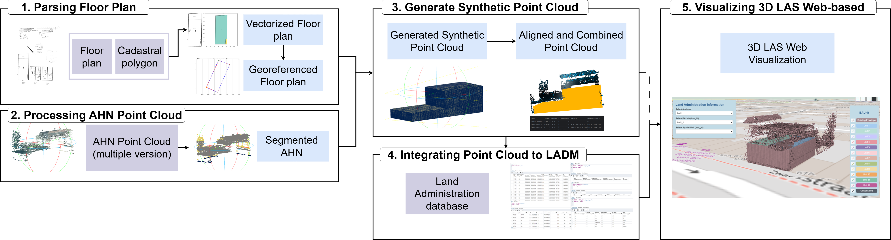

<p align="center">
  
  <br>
</p>

# Point Cloud for 3D Land Administration System (LAS)

## Abstract:
As cities grow denser and more and more in vertical directions, Land Administration Systems (LAS) must evolve to represent complex, multi-level property ownership, particularly in apartment buildings. While Building Information Models (BIM) are commonly used for 3D representation, their availability remains limited for many buildings. This research explores the use of point clouds as an alternative means to represent 3D spatial units in LAS, focusing on the integration of cadastral floor plans and the airborne Lidar point cloud datasets (in our case AHN.)

Three apartment cadastral drawings from different years in Rotterdam serve as case studies. The proposed methodology involves five main steps: (1) parsing the scanned image of the floor plans using image processing to extract cadastral room boundary polygons; (2) segmenting AHN point cloud (3); generating synthetic point clouds by extruding floor plan polygons and aligning them with AHN; (4) storing these 3D spatial units in a PostgreSQL-based database following the ISO 19152:2024 LADM; and (5) developing a web-based 3D LAS using Vue.js, Cesium, and FastAPI for visualization and interaction.

Results show that unit boundaries can be extracted from cadastral drawings and converted into 3D point clouds for integration into a cadastral database. The synthetic point clouds include room-level attributes and spatial identifiers, enabling interactive visualization and LADM information through a web interface that can be accessed by the public and stakeholders. However, challenges such as misalignment due to occlusion in AHN data and inconsistent quality in older floor plan drawings affect the accuracy and automation of the process.

This research demonstrates that point clouds can effectively serve as final 3D representations in land administration, enabling a seamless integration with AHN that offers representation of real-world features such as building facades, walls, and fences, which often delineate cadastral boundaries. 

## Procedure:
The code is organized into two parts:
### Construct Building Point Cloud from Floor plan: 
This part can be found in [ConstructPC.ipynb](ConstructPC.ipynb), which involves the first three steps of the pipeline: 

(1) parsing the scanned image of the floor plans using image processing to extract cadastral room boundary polygons; 

(2) segmenting AHN point cloud 

(3) generating synthetic point clouds by extruding floor plan polygons and aligning them with AHN; 


### Visualize 3D LAS:
This second part is documented in [3DLASWeb](3DLASWeb) involving the last two steps of the pipeline:

(4) storing these 3D spatial units in a PostgreSQL-based database following the ISO 19152:2024 \ac{LADM}; and 

(5) developing a web-based 3D LAS using Vue.js, Cesium, and FastAPI for visualization and interaction.

To run the web program:
1. Set the database in pgAdmin
   1. download the sample database in [GDrive](https://drive.google.com/file/d/1YOkyEus1ibRDXM3h6cEZJEjUol1VQeQO/view?usp=sharing)
   2. create new database and import the database. in cmd, run:
   ```sh
   createdb -U postgres ladm_data
   pg_restore -U postgres -d ladm_data ladm_sample.sql
   ```
   3. to import your new csv output from previous method, run the following SQL query:
   ```sh
   #Import the output csv in synth_pc table
   COPY synth_pc (point_id, room_id, floor_number, x, y, z, name, su_id, area, k_id)
   FROM output_pc
   DELIMITER ',' 
   CSV HEADER;
   
   #Create the geom column for pc
   UPDATE synth_pc
   SET geom = ST_Transform(
       ST_SetSRID(ST_MakePoint(x, y, z), 28992),
       4326
   )
   WHERE geom IS NULL;

   #create and import your own su data based on the output_pc
   COPY la_su_table
   FROM su_output_pc
   DELIMITER ',' 
   CSV HEADER;
   ```
2. Upload the output LAZ file from the previous step into [CesiumION](https://ion.cesium.com/addasset) (or use the existing dataset). Remember to change the ```Ion.defaultAccessToken ``` in [App.vue](3DLASWeb/src/App.vue)
3. In terminal:
   ```sh
   cd 3DLASWeb
   npm run dev   
   uvicorn pgquery:app --reload
   ```
4. To modify the front-end interface, edit [App.vue](3DLASWeb/src/App.vue). the syle can be changed in [LAStyle.css](3DLASWeb/src/LAStyle.css)
5. To modify the back-end process, edit [Pgquery](3DLASWeb/pgquery.py)

